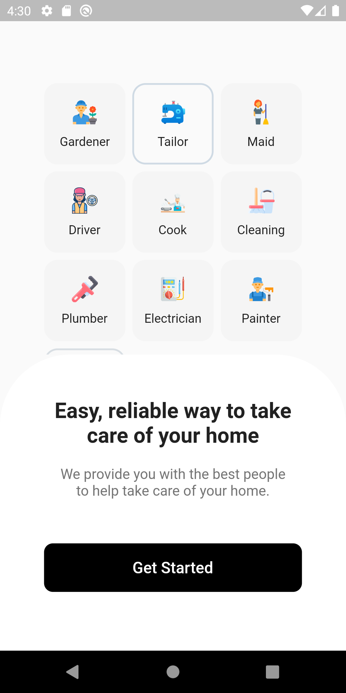

## 100 Days of Flutter Coding | Day 1

```dart
@override
  Widget build(BuildContext context) {
    return Scaffold(
      appBar: AppBar(
        title: const Text('Flutter Home Service Application UI Kit'),
      ),
      body: Center(
        child: Text('A Home Service Application UI Kit built using Flutter. This app allows customers to hire service providers like plumbers, electricians, carpenters and various kinds of service providers'),
      ),
  );
}
```

# Contributing to Flutter Home Service App

I welcome and appreciate contributions to this open-source project!

## Getting Started
1. Fork this repository on GitHub
2. Clone this repository to your local machine
```
flutter pub get
flutter run
```
3. Create a new branch for your changes

## Making Changes
1. Add your changes
2. Run tests (if applicable)
3. Commit your changes with a clear and descriptive commit message

## Submitting a Pull Request
1. Push your changes to your fork on GitHub
2. Open a Pull Request and include a clear and descriptive title and explanation of your changes
3. I will review and merge your changes


## Screenshots

